# aws-lambda-r - Configure AWS for production deployment

**Note: these instructions are not complete.** If you are already familiar with AWS,
please review the files in `scripts/` and `settings/`.

These are instructions to be followed before running the scripts. At the end of 
these instruction you should have obtained the values for the following keys:

```
IAM_ACCESS_KEY_ID=""
IAM_SECRET_ACCESS_KEY=""
IAM_LAMBDA_FUNCTION_ROLE=""
EC2_KEY_NAME=""
EC2_KEY_FILE=""
EC2_SUBNET_ID=""
EC2_SECURITY_GROUP_IDS=""
S3_BUCKET=""
API_ID=""
API_RESOURCE_ID=""
API_ALIAS_RESOURCE_ID=""
API_AUTHORIZER_ID=""
API_TOKEN=""
```


## IAM 

IAM manages access to AWS.

1. Create an IAM user account to be used only in conjunction with these scripts
    + retain the values of **ACCESS_KEY_ID** and **SECRET_ACCESS_KEY**
2. Give necessary permissions to this user
    + in general more automation requires more permissions
    + TBD
3. Create roles and policies 
    + attach policies to the roles
    + TBD


## SSH Key

SSH Keys allows access through an SSH tunnel to an AWS EC2 instance.

### Create and save SSH key for EC2 connection

1. Go to AWS Web Console
2. Go to EC2 Service
3. Select **Key Pairs** under **NETWORK & SECURITY** menu. 

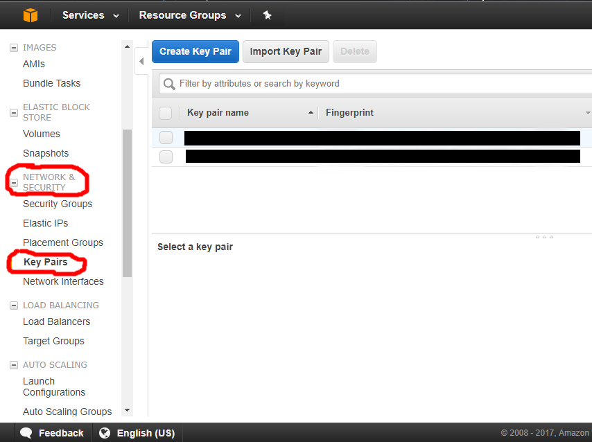

4. Press "Create Key Pair" button and give the key a name. When you press the 
"Create" button, the browser will download the key.


5. Open the folder containing downloaded key (a `.pem` file having the same name as the created key)

6. Copy the `.pem` file to:
    - on Windows: `C:\Users\<your_user_Name>/.ssh/` folder 
        + in order to show hidden folders go to Folder Menu > View > Check "Hidden items"
    - on OSX and Linux: `~/.ssh/` 
        + Additional commands might be necessary from terminal:
        + `chmod 700 ~/.ssh`
        + `chmod 400 ~/.ssh/<your_key_file>.pem`
        + other instructions: [1](https://unix.stackexchange.com/a/115860) and 
        [2](http://docs.aws.amazon.com/AWSEC2/latest/UserGuide/AccessingInstancesLinux.html)


## VPC

### Create dedicated VPC 

1. Go to AWS Web Console
2. Select VPC from Services menu
3. From VPC Dashboard, click "Start VPC Wizard".


4. Choose "VPC with a Single Public Subnet" and click the "Select" button.

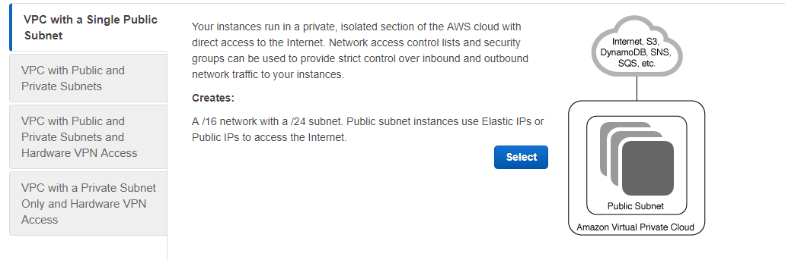

5. Optionally, fill in VPC name and Subnet name fields (e.g., `aws-lambda-r-vpc` and `aws-lambda-r-subnet`).


6. Click the "Create VPC" button.
7. Make note of Subnet ID (`EC2_SUBNET_ID`)
8. Make note of VPC ID for future reference


### Edit subnet

1. Go to AWS Web Console
2. Select VPC from Services menu
3. From VPC Dashboard, Virtual Private Cloud section, select "Subnets"
4. Select the subnet previously created.
5. From "Subnet Actions" menu, select "Modify auto-assign IP settings" option.


6. Check "Enable auto-assign public IPv4 address".

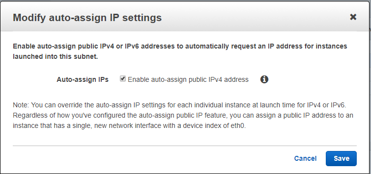


## Create security group (if not already present)

1. Go to AWS Web Console
2. Select VPC from Services menu
3. From VPC Dashboard, Virtual Private Cloud section, select "Security Groups".
4. Look for the VPC ID of the previously created VPC.
5. If not present, click the "Create Security Group" button.
6. Add an Inbound rule to allow SSH
    + e.g. `SSH  TCP  22  Anywhere (0.0.0.0/0, ::/0)`
7. Make note of the Security Group ID (`EC2_SECURITY_GROUP_IDS`)
8. Optionally, give it a informative name tag (e.g., `aws-lambda-r-sg`)


## LAMBDA

### Create Lambda Authorizer function (automated, see `aws_setup.sh` script)

1. Create Lambda Authorizer function
2. Go to Services, Lambda
3. Click on "Create a function" button
5. Select "Author from scratch function" option
6. Give the function a name and assign a lambda role previously created
7. Click on "Create function" button
8. From Lambda Configuration Tab, Function Code section, select "Edit code inline"
option and runtime Node.js.6.10
9. Copy the content of the index.zip archive into the inline code editor.
Make sure that the value of API_TOKEN is modified and matches the value in settings.

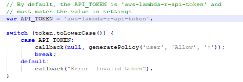

10. Click "Save" button

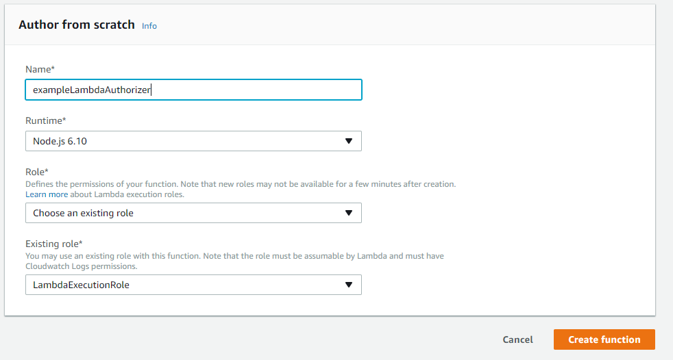

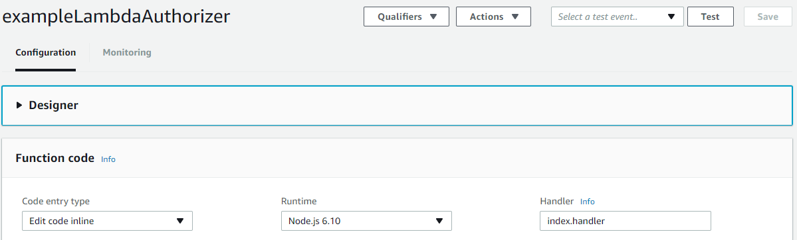


##  S3 BUCKET

1. Go to Services, S3
2. Click "Create bucket" button
3.Complete the fields related to bucket name and region.
Make sure that the chosen region matches the one in settings.
4. Click "Create" button

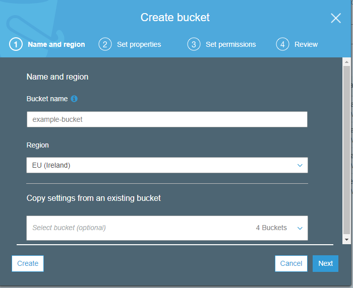

## API GATEWAY

### Create API (automated, see `aws_setup.sh` script)

1. Go to Services, API Gateway
2. Click on "Get Started" button
3. Click "New API" button
4. Complete API details and then click "Create API" button

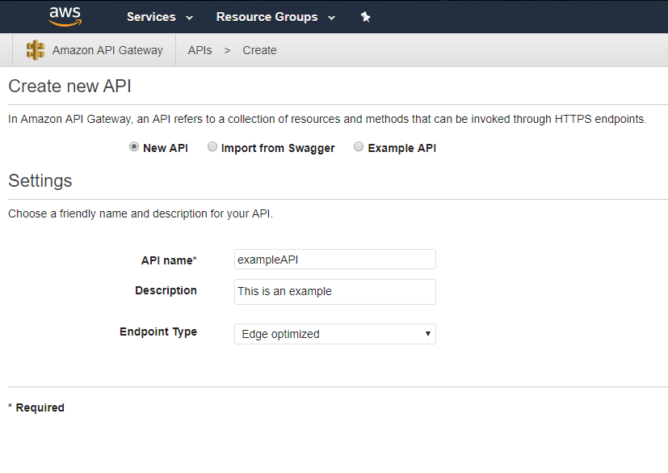

### Create resources (automated, see `aws_setup.sh` script)

1. From the side bar of Amazon API Gateway, select APIs section and then your API
2. Select the Resources section and then click on "Actions" dropdown in order to select "Create Resource" option
3. Give a name to resource and click on "Create Resource" button

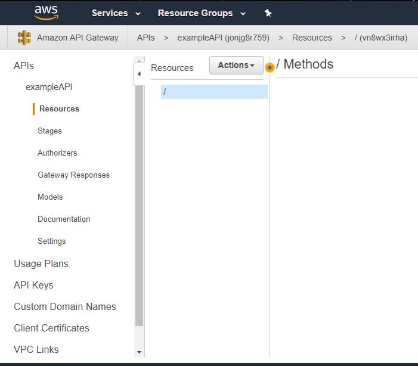

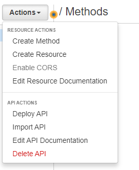

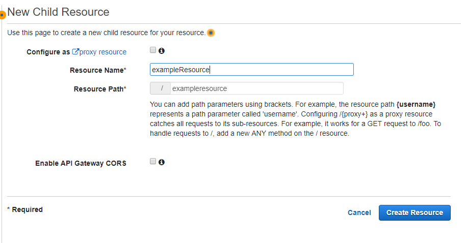

### Create authorizer (automated, see `aws_setup.sh` script)

1. Create Lambda Authorizer function (see above)
2. Create API authorizer
3. From the side bar of Amazon API Gateway, select APIs section and then your API
4. From "Authorizers" section, click "Create New Authorizer" button
5. Complete the fields for the authorizer making sure that the corresponding region of 
Lambda Authorizer function is selected
6. After clicking "Create" button a pop-up will appear, asking for lambda function permission
7. Click "Grant and Create" button

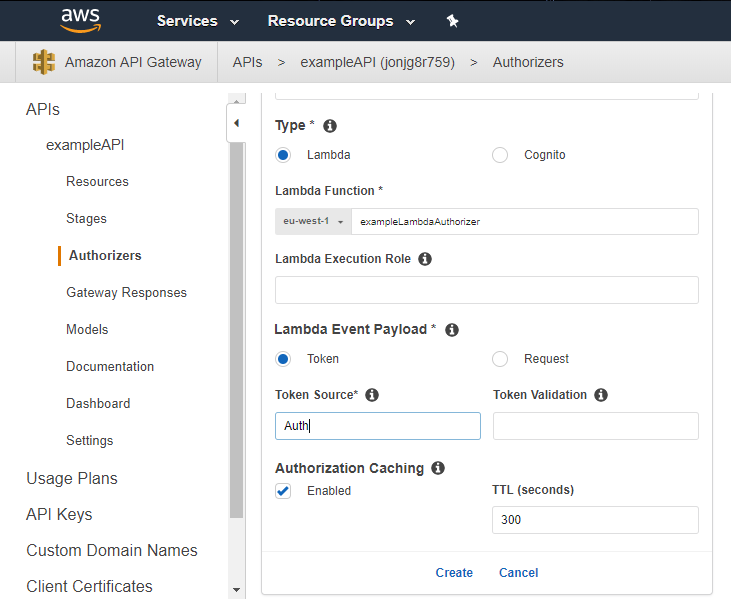

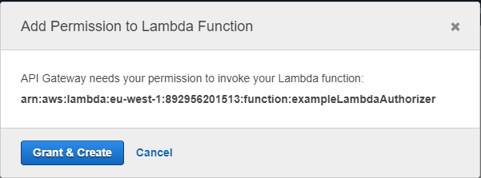

### Create stages  

1. If there is no deployment version of the API and no previous stage created 
1.1 Go to Actions dropdown and select "Deploy API" option
1.2 Select New Stage option from the deployment stage field
1.3 Click "Deploy" button

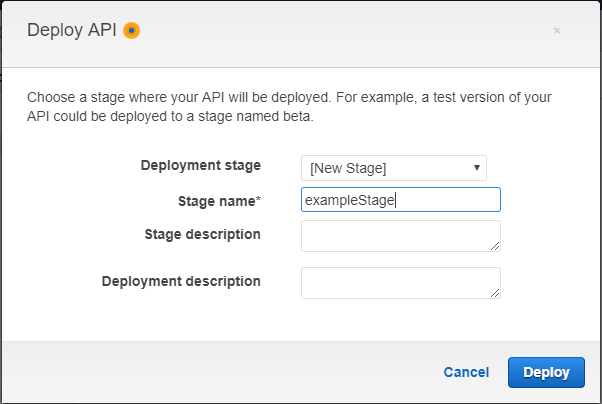

2. If there is a2 deployment version of the API
2.1 Go to "Stages" section from Amazon API Gateway sidebar and click "Create" button
2.2 Give the stage a name and choose a deployment for the stage
2.3 Click "Create" button

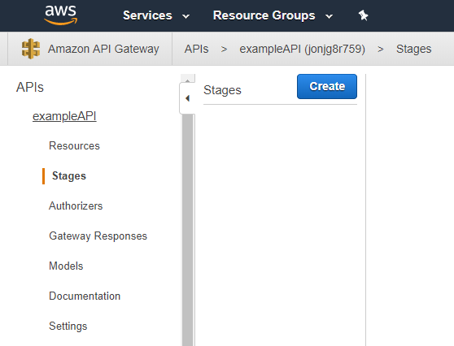

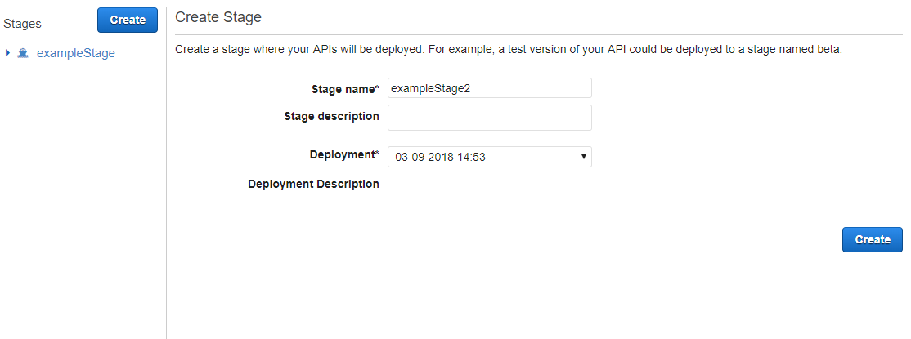

### Attach role for CloudWatch logging to API
### Enable CloudWatch Logging on stages
