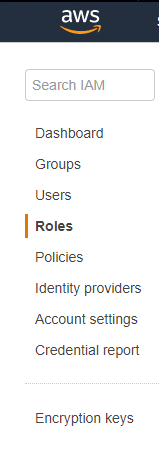
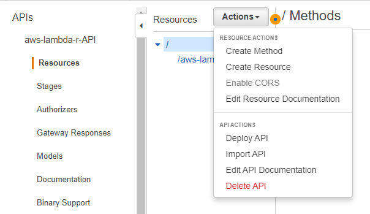
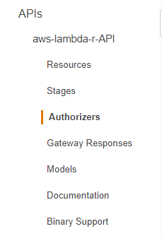

# aws-lambda-r - Configure AWS for production deployment

Use these instructions to manually delete AWS configurations created by scripts.

## DELETE SERVICES

### VPC

1. Go to AWS Console
2. Select VPC from Services menu
3. From VPC Dashboard,Virtual Private Cloud section, select "Your VPC's"
4. Select the VPC you want to delete
5. Click the "Actions" button 

6. Select "Delete VPC" option

Note: Make sure that no instances that belong to the VPC are running before deleting it

### Subnet

1. Go to AWS Console
2. Select VPC from Services menu
3. From VPC Dashboard, Virtual Private Cloud section, select "Subnets"
4. Select the subnet you want to delete
5. Click on "Actions" button 

6. Select "Delete Subnet" option

Note: Follow the same steps in order to delete security group

### EC2 Instance

1. Go to AWS Console
2. Select EC2 from Services menu
3. Click on "Instances" option from the sidebar
4. Select instance from the list of EC2 instances
5. Click on "Actions" button and choose Instances, Terminate

### AMI

1. Go to Services, EC2
2. From the sidebar menu, click on AMIs section
3. Select AMI from the list of AMI's
4. Click on "Actions" button and choose "Deregister"

### Snapshot 

1. Go to Services, EC2
2. From the sidebar menu, click on Snapshots section
3. Select snapshot from the list of snapshots
4. Click on Actions button and choose Delete option

## Service Role
1. Go to AWS Console
2. Select IAM from Services menu
3. From IAM Dashboard, select "Roles"

4. Select the role you want to delete 

5. Click on "Delete role" button

## Lambda Function
1. Go to AWS Console
2. Select Lambda from Services menu
3. Select "Functions" from AWS Lambda menu
4. Select the function you want to delete 

5. Click on "Delete" button

## S3 Bucket
1. Go to AWS Console
2. Select S3 from Services menu
3. Select the bucket you want to delete

4. Click the "Delete bucket" button

## API
1. Go to AWS Console
2. Select API Gateway from Services menu
3. Select the API you want to delete
4. Click the "Actions" button
5. Select "Delete API" option

## API Resources
1. Go to the API that contains the resource you want to delete
2. Select the resource you want to delete
4. Click the "Actions" button
5. Select "Delete Resource" option

## API Authorizers
1. Go to the API that contains the authorizer you want to delete
2. Select "Authorizers" from the API's menu

3. Click on "Delete Authorizer" button placed in the right corner of 
authorizer description section 

