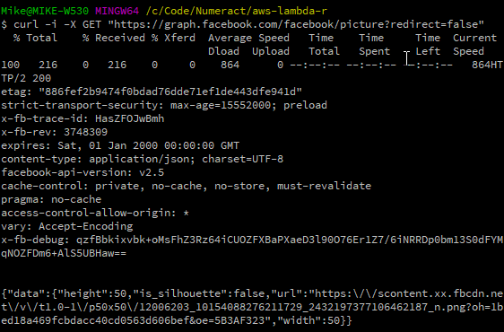
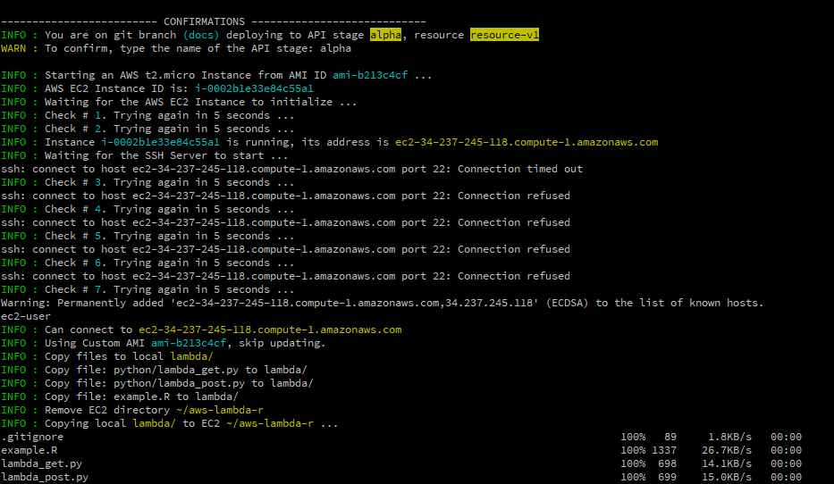
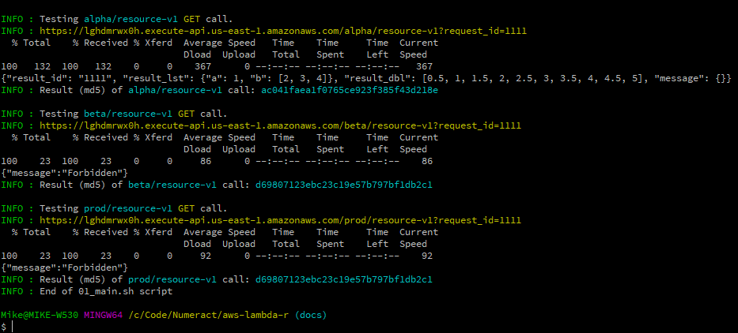

## Of R and APIs: Running R in Amazon Lambda

- Slides: <https://numeract.github.io/aws-lambda-r/>  

- Code: <https://github.com/numeract/aws-lambda-r>  
<br>

**Mike Badescu, PhD**  

- [*mike*.*badescu@numeract*.*com*](*mike*.*badescu@numeract*.*com*)  
- @[MikeBadescu](https://twitter.com/MikeBadescu)  
<br>

**Dallas R Users Group**  
*March 24, 2018*


## About

**[Numeract LLC:](http://numeract.com/)**

- Data Science and Economics / Finance consulting services  
- Technology Stack: (Postgre)SQL, R, Python, Spark, Docker, AWS

<br>

**Code Authors and Contributors:**

- [Mike Badescu](https://www.linkedin.com/in/mikebadescu)
    + PhD Economics, Lehigh University
    + Experience: Economics, Finance, Statistics, Machine Learning
- Ana Niculescu
- Teodor Ciuraru


## Summary 

1. Motivation

2. Plumber

3. OpenCPU

4. R on Amazon Lambda


## Motivation

**Typical Data Product Progression**

1. Exploratory Data Analysis
    + get the data
    + some cleaning too
2. Proof of Concept
    + R Markdown report
3. Stakeholder Engagement and Validation
    + Shiny App
    + Iterate steps 1-3 as needed


## Motivation

4.&nbsp;**Can we use it in production?**

- _Is Shiny scalable?_
- _We already have a dashboard, we do not use Shiny._
- _Can we use the current R code but without Shiny?_
- _How do we integrate it with our current code base?_

<br>

- Rewriting the code in other programming language is not efficient
- Certain algorithms are not available in other programming languages


## Solutions

- Install R on the same machine as the production server
    + Increases chases on failure, maintenance issues
    + Security issues
- R running inside of a VM next to other VMs
    + _How do we connect to it?_
    + _Use files? Read from a Database?_
- API
    + _Can we have an API?_
    + _Can it be a REST API?_


## API

- Modularize the application: calls from Client to Server
- Programming language independent
- Common concept: programmers know how to work with APIs
- Common "data language": **JSON** (but not the only one)
- REST API
    + stateless --> pure functions
    + over HTTP, browsable
- Over HTTP, two main methods:
    + **GET**: sends a request to a server and waits for data
    + **POST**: sends data to the server and wait for an answer


## API Example

**HackerNews API**

- <https://github.com/HackerNews/API>
- <https://hacker-news.firebaseio.com/v0/item/8863.json?print=pretty>
```{js, eval=FALSE}
{
  "by" : "dhouston",
  "descendants" : 71,
  "id" : 8863,
  "kids" : [ 9224, 8952, 8917, 8884, 8887, 8943, 8869, 8940, 8958, 9005, 9671, 9067, 8908, 9055, 8865, 8881, 8872, 8873, 8955, 10403, 8903, 8928, 9125, 8998, 8901, 8902, 8907, 8894, 8870, 8878, 8980, 8934, 8876 ],
  "score" : 104,
  "time" : 1175714200,
  "title" : "My YC app: Dropbox - Throw away your USB drive",
  "type" : "story",
  "url" : "http://www.getdropbox.com/u/2/screencast.html"
}
```

## API Example

**Facebook Graph API**

- <https://developers.facebook.com/docs/graph-api/overview>
- <https://graph.facebook.com/facebook/picture?redirect=false>
```{js, eval=FALSE}
{
   "data": {
      "height": 50,
      "is_silhouette": false,
      "url": "https://scontent.xx.fbcdn.net/v/t1.0-1/p50x50/12006203_10154088276211729_2432197377106462187_n.png?_nc_cat=0&oh=1bed18a469fcbdacc40cd0563d606bef&oe=5B3AF323",
      "width": 50
   }
}
```


## API Calls

Main Tool: **[curl](https://curl.haxx.se/)**

- free and open source
- can handle: FTP, FTPS, HTTP, HTTPS, IMAP, SCP, etc.
- deals with SSL certificates, cookies, HTTP headers, etc.
- R packages:
    + [curl](https://cran.r-project.org/package=curl) by Jeroen Ooms
    + [RCurl](https://cran.r-project.org/package=RCurl) by Duncan Temple Lang and the CRAN team


## API Example

Facebook Graph API: using curl from [Git Bash](https://gitforwindows.org/)




## R and API

**Can we serve API requests from R?**

- not directly, as R is not a web server
- we need a wrapper / server that:
    + receives requests and handles them to R
    + passes any response from R to the client

**Approaches**

- web server / container: 
    + plumber and OpenCPU
- serverless: wrap R functions inside FasS (Function as a Service)
    + running R on AWS Lambda

## plumber

_An R package that generates a web API from the R code you already have._

- main author: Jeff Allen
- package website: <https://www.rplumber.io/>
- usage:
    + use function decorators, similar to `roxygen2`
    + call `plumb()` on the `.R` file 
    + access local server, similar to `shiny`
- quick, interactive loop: code <==> local server => prod server
- has its own web server to deploy in production
- very good documentation and examples
    + source of following examples


## plumber

**Decorators**

```{r, eval=FALSE}
#* @get /mean
normalMean <- function(samples = 10) {
    data <- rnorm(samples)
    mean(data)
}


#* @post /sum
addTwo <- function(a, b) {
    as.numeric(a) + as.numeric(b)
}
```


## plumber - Local Server

```{r, eval=FALSE}
install.packages("plumber")

r <- plumber::plumb("docs/plumber_functions.R")

r$run(port = 8000)
```

**GET Method**

- http://localhost:8000/mean  
- http://localhost:8000/mean?samples=10000

**POST Method**

```{bash, eval=FALSE}
curl --data "a=4&b=3" "http://localhost:8000/sum"
```


## plumber - Features

Output customization, including JSON (default), HTML, PNG, JPEG

```{r, eval=FALSE}
#' @get /plot
#' @png
function(){
    myData <- iris
    plot(myData$Sepal.Length, myData$Petal.Length,
         main="All Species", xlab="Sepal Length", ylab="Petal Length")
}
```


## plumber - Features

**Filters**

- pipeline of handling requests
- can be used as authenticators (similar to AWS Lambda functions)

```{r, eval=FALSE}
#* @filter checkAuth
function(req, res){
    if (is.null(req$username)){
        res$status <- 401 # Unauthorized
        return(list(error="Authentication required"))
    } else {
        plumber::forward()
    }
}
```


## plumber - Features

**Dynamic Routes**

- API endpoint: `/users/13`, where `13` is dynamic

```{r, eval=FALSE}
#' @get /users/<id>
function(id) {
    subset(users, uid == id)
}
```


## plumber - Deployment

**Local Server**

- Single threaded R instance

**Web Server / Docker**

- VMs (documentation example for Digital Ocean)
- RStudio Connect
- Docker: single container
- Docker: multiple plumber instances
    + traffic routed by `nginx`
    + use load balancing to scale horizontally

## OpenCPU

_A reliable and interoperable HTTP API for data analysis based on R._

- author: Jeroen Ooms
- package website: <https://www.opencpu.org/>
- usage on local machine:
    + write functions ==> deploy within a package
    + start server, call API (`tmp` key for extra info)
- testing new code on the local server takes longer
- JavaScript Client
- web server with more features


## OpenCPU

**Local Server Demo**

```{r, eval=FALSE}
install.packages("opencpu")

library(opencpu)

ocpu_start_app("rwebapps/appdemo", port = 5656)
```

Local Server UI: <http://localhost:5656/ocpu/test/>  
- test GET and POST methods

Other Apps: <https://www.opencpu.org/apps.html>  
- example: [nabel](https://rwebapps.ocpu.io/nabel/www/)

JavaScript Client on jsfiddle: <http://jsfiddle.net/user/opencpu/>  
- example: [Posting Code Snippets](http://jsfiddle.net/opencpu/4dgdM/)


## OpenCPU

**Features**

- The `tmp` key exposes: the input(command), the code, the output
- Linux OpenCPU Server for production deployment
    + support for parallel/async request ==> get a large server
    + AppArmor for App security within Linux
    + Docker container
    + Authentication through apache2 / nginx authentication modules

**Deployment**

- Similar to `plumber`, except no RStudio Connect


## Web Server / Docker vs FaaS

**Web Server / Docker**

- common linux layer
- application specific containers
    + flexible memory and CPU resources
- if only one container (_**0 to 1 issue**_)
    + always running
    + not scalable
- more than one container (_**1 to N issue**_)
    + minimum framework needed: cache, load balancing 
    + auto-scaling up to a **given N** containers


## Web Server / Docker vs FaaS

**Function as a Service**

- In general, a platform to build apps while minimizing infrastructure maintenance
- The focus is on the code / functionality, not DevOps
- Pay only for what you use
- Horizontally Scalable
- "Smaller Containers": usually resources are limited
- Programming languages:
    + Initially: Java, JavaScript, C#, GO
    + Now Python is being added by more providers
    + Docker containers are becoming more popular


## Web Server / Docker vs FaaS

**FaaS providers** (as of March 2018)

- Amazon: [AWS Lambda](https://aws.amazon.com/lambda/)
    + Node.js, Python, Java, C#, and Go
- Google: [Google Cloud Functions](https://cloud.google.com/functions/)
    + Node.js
- Microsoft: [Azure Functions](https://azure.microsoft.com/en-us/services/functions/)
    + Node.js, Java, C#, F# 
    + Python and other experimental


## Web Server / Docker vs FaaS

**FaaS providers** (cont.)

- Apache: [OpenWhisk](https://openwhisk.apache.org/)
    + on [IBM Bluemix](https://console.bluemix.net/openwhisk/)
    + JavaScript, Swift, Python, PHP function, Java
    + any binary-compatible executable including Go programs 
    + Docker
- Oracle: Cloud Platform / [Fn project](http://fnproject.io/)
    + Java, Go, Python, and Ruby
    + Docker


## Web Server / Docker vs FaaS

**Common concerns**

- How to authenticate the client?
    + HTTP Headers, tokens, etc,
- How to encrypt communication with the client?
    + HTTPS
- How to limit the resources?
    + Limits on CPU run time, memory and disk
    + Careful not to [DDOS](https://www.rplumber.io/docs/security.html#dos) yourself!
- How fast to scale horizontally?
    + How easy/fast is to go from **0 to 1** calls?
    + How easy/fast is to go from **1 to N (small)** calls?
    + How easy/fast is to go to **N (large)** calls?


## R on FaaS

**Previous Work**

- [Analyzing Genomics Data at Scale using R, AWS Lambda, and Amazon API Gateway](https://aws.amazon.com/blogs/compute/analyzing-genomics-data-at-scale-using-r-aws-lambda-and-amazon-api-gateway/) by Anish Kejariwal, July 2016
    + the inspiration source for our project
    + trick: use Python package `rpy2` to call R from Python
- [Go serverless with R Scripts on Azure Function](https://azure.microsoft.com/en-us/blog/azure-function-r/),
by Thomas Delteil, July 2017
    + GitHub: <https://github.com/thdeltei/azure-function-r>
    + needs updated R extensions on Azure
    + seems that it requires Windows


## aws-lambda-r

**Motivation**

- Proof of concept validated by client (Shiny rocks!)
- App engine tasks:
    + get a request id, 
    + get data from a database DB
    + process data for 5-20 sec
- **Q:** How to use this code in production?
    + needs to be triggered by the production server
    + not possible to run R on the same server
    + large processing back load
    + uncertain and irregular future demand


## aws-lambda-r

- **Solution: R on AWS Lambda**
    + excited about **0 to N (large)** scalability
    + very low costs
    + allows us to change the implementaion details (Python?) later
- **[numeract/aws-lambda-r](https://github.com/numeract/aws-lambda-r)** on GitHub
    + not an R package
    + a series of Bash scripts 
- **A framework**
    + uses AWS CLI through (Git)Bash ==> available on all platforms
    + it is flexible because AWS changes often
    + easy to adapt to automatically deploy Python or js functions


## aws-lambda-r - Details

**Top view**

- Deploy R function on AWS Lambda
- Configure access to AWS Lambda

**How hard can it be?**


## aws-lambda-r - Details

- **Deploy R function on AWS Lambda**
    + needs to be called from Python
    + create a temporary `.zip` deployment package and store it on S3
- **Configure access to AWS Lambda**
    + configure API Gateway
    + configure AWS Lambda

## aws-lambda-r - Details

- **Deploy R function on AWS Lambda**
    + needs to be called from Python
        + temporary EC2 instance
        + install Python, R + packages
        + copy R files to EC2
    + create a temporary `.zip` deployment package and store it on S3
- **Configure access to AWS Lambda**
    + configure API Gateway
        + create API resources and HTTP methods
        + create another Lambda function to use as authorizer
    + configure AWS Lambda
        + size, permissions


## aws-lambda-r - Details {.smaller}

- **Deploy R function on AWS Lambda**
    + needs to be called from Python
        + temporary EC2 instance
            + create IAM roles, VPC, security groups, etc.
        + install Python, R + packages
            + figure out what other Linux packages are needed + a Python wrapper
        + copy R files to EC2
    + create a temporary `.zip` deployment package and store it on S3
        + figure out what files to copy
- **Configure access to AWS Lambda**
    + configure API Gateway
        + create API resources and HTTP methods
            + account for API versioning
        + create another Lambda function to use as authorizer
    + configure AWS Lambda
        + size, permissions


## example.R

```{r, eval=FALSE}
aws_lambda_r <- function(input_json) {
    output_json <- '{"message": "Cannot create output JSON"}'
    tryCatch({
        input_lst <- from_json(input_json)
        request_id <- input_lst$request_id[1]
        output_lst <- list(
            result_id = request_id,
            result_lst = list(a = 1, b = 2:4),
            result_dbl = 1:10 / 2,
            message = NULL
        )
        output_json <- to_json(output_lst)
    }, error = function(e) {
        output_json <<- paste0('{"message": "', e$message, '"}')
    })
    output_json
}
```


## lambda_get.py {.smaller}

```{Python, eval=FALSE}
import os
os.environ["R_HOME"] = os.getcwd()
os.environ["R_LIBS"] = os.path.join(os.getcwd(), 'libraries')
import rpy2
import ctypes
import rpy2.robjects as robjects
import json

for file in os.listdir('lib/external'):
    file_name='lib/external/' + file
    ctypes.cdll.LoadLibrary(os.path.join(os.getcwd(), file_name))

# source R file
# this R file might load libraries and source other files
robjects.r['source']('example.R')

# exposing R entry point to python
aws_lambda_r = robjects.globalenv['aws_lambda_r']

def handler_get(event, context):
    input_json = json.dumps(event)
    output_json = json.loads(str(aws_lambda_r(input_json)))
    return output_json
```


## Bash scripts

**What we need**

- AWS account
- AWS CLI installed and configured on the local machine
    + look for a `~/.aws/` directory with two files
    + get a SSH key from AWS and place it in  `~/.ssh/`directory
    + **keep your secrets safe!!**
- Copy these directories to your app:
    + `lambda/` - will contain your `.R` and `.py` files before uploading to AWS
    + `python/` - Python scrips (one is usually sufficient)
    + `scripts/` - configuration and deployment
    + `settings/` - default, auto-config, user settings and secrets


## Bash scripts - `settings/`

- `settings_default.sh`
    + for reference, list of variables that need to be populated 
- `secrets_default.sh`
    + for reference, list of access keys, names, IDs to be populated
- `setup_auto.sh`
    + list of variables populated by the auto-configuration scripts
    + **keep this file safe** - do not commit to GitHub!
- `setup_user.sh`
    + user overriding settings and secrets
    + **danger:** you will enter your AWS ACCESS KEY here
    + **keep this file safe** - do not commit to GitHub!


## Bash scripts - `scripts/`

**Auto-configuration**: settings will be saved in `setup_auto.sh`

- `21_setup_vpc.sh`
    + setup a new VPC in a AWS zone indicated in settings
- `22_setup_custom_ami.sh`
    + new AMI = AWS Lambda Linux + updates + Python + R + packages
    + calls [`11_install_packages.sh`](../scripts/11_install_packages.sh)
- `23_setup_s3.sh`
    + creates an AWS S3 bucket if not already present
- `24_setup_lambda.sh`
    + creates Lambda Authorizer function
    + creates and configures API Gateway


## Bash scripts - `scripts/`

**Local Scripts**

- `01_main.sh`: calls all other local scripts
- `02_setup.sh`: loads all settings
- `03_check_settings.sh`: checks and print outs
- `04_create_ec2.sh`: new EC2 instance
- `05_update_ec2.sh`: update EC2 if no custom AMI found
- `06_copy_files.sh`: copy files from local to EC2
    + list files to copy in `settings/lambda_files.txt`
- `07_deploy_lambda.sh`: calls remote scripts
- `08_terminate_ec2.sh`: terminate EC2 instance
- `09_test_deployment.sh`: curl deployment tests


## Bash scripts - `scripts/`

**Remote Scripts**

- `12_configure_ec2.sh`
    + remote configuration (loads all settings)
- [`13_create_deployment_package.sh`](../scripts/13_create_deployment_package.sh)
    + creates the `.zip` deployment package
- [`14_create_lambda_api_method.sh`](../scripts/14_create_lambda_api_method.sh)
    + configures API Gateway & Lambda
- `15_create_alias_api_method.sh`
    + optional, configures a mirror API (e.g. most recent version)


##  aws-lambda-r - Demo

Deployment in AWS region `us-east-1` (N. Virginia)

- Prepare
    + Check user settings
    + Create VPC
    + Create AMI
    + Setup AWS S3
    + Setup AWS Lambda and API Gateway
- **Deploy / Run the main script**


##  aws-lambda-r - Demo




##  aws-lambda-r - Demo




## References {.smaller}

- Trestle Technology, LLC. 2017. [_Plumber: An API Generator for R._](https://www.rplumber.io/)

## sessionInfo() {.smaller}

```{r, echo=FALSE}
sessionInfo()
```
